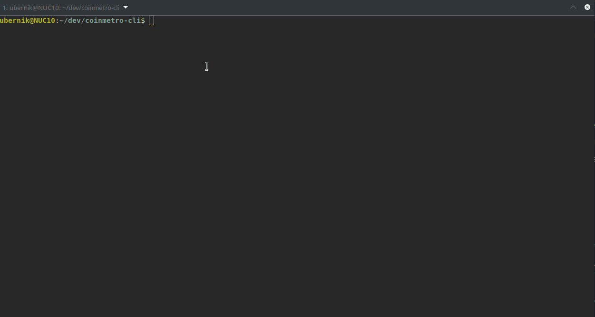
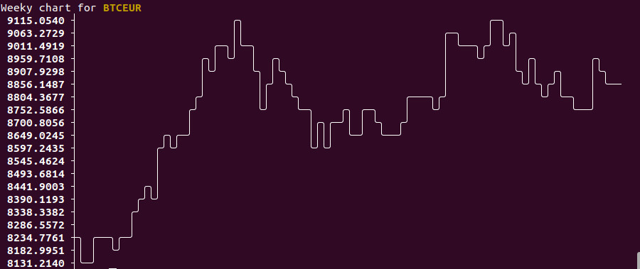
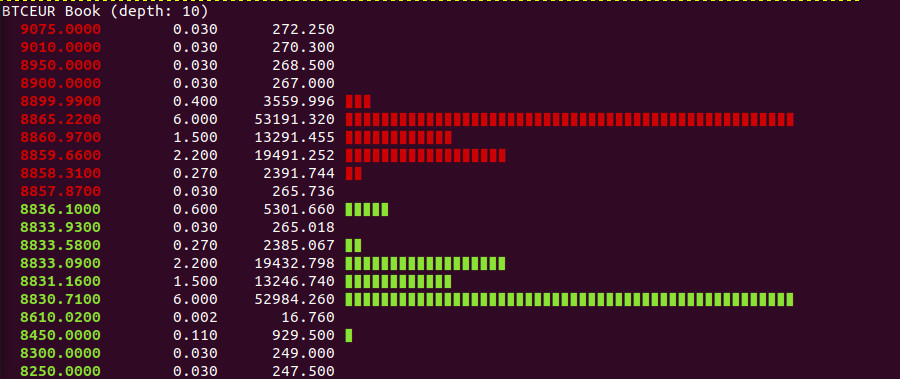

# Coinmetro-CLI







A little side project i made in my spare time (and still a work in progress) for accessing Coinmetro Crypto Exchange using the terminal.

Coinmetro are a transparent, regulations compliant exchange that should appeal to newbies and pros. Visit [coinmetro.com](https://coinmetro.com?ref=u2ros) to learn more about the different products they offer.

Please note this is not an official Coinmetro product, it is in early stages, so use at your own risk or use demo mode. The application does not send your credentials to any third party in any way (feel free to examine the source)

## Installation

### From source (recommended)
Coinmetro CLI is a node.js application, so you need [node.js](https://nodejs.org/en/) installed to run it.

If you know how to use git just clone the repository, then install it with npm:

```
    cd coinmetro-cli
    npm install -g ./
```

This will install Coinmetro CLI as a global command. You can then use your terminal to input your commands.

### Binaries

Binaries are packaged using [pkg](https://github.com/zeit/pkg) utility. Look under [releases](https://github.com/u2ros/coinmetro-cli/releases) to download the release for your platform. Rename the downloaded executable into cm (or cm.exe on windows) and place it somewhere on your PATH, or cd your terminal to the same folder where you unpacked and renamed your cm(.exe) executable.

**IMPORTANT: Always use binaries you downloaded from this site. Never use any third party download links!!!**

## Quickstart usage

Coinmetro-CLI will start in demo mode by default. If you want to use it with your actual balance, issue the command below. This is followed by an 'auth login command', which updates your login token and enable you to use trading/balance functions related to your account. If you want to start in demo mode, omit the 'cm auth live' command.

```
    cm auth live                                  // switch to live mode
    cm auth login <your email> <your password>    // login to update accesss token
```

Using the cmd module, you can store and chain commands for later use like so:

```
    cm cmd store "cm auth demo && cm auth login myname@blabla.com mypass" demo
    cm cmd store "cm auth live && cm auth login myname@blabla.com mypass" live

    // Warning: These particular commands will also store your credentials in plain text inside .coinmetro-cli/cmd file inside your home folder, so use with caution!
```

Or, for example, if you use 2FA, you can use the same command, with an optional parameter (parameters are specified with %p)

```
    cm cmd store "cm auth demo && cm auth login myname@blabla.com mypass %p" demo
    cm cmd store "cm auth live && cm auth login myname@blabla.com mypass %p" live

    // Warning: These particular commands will also store your credentials in plain text inside .coinmetro-cli/cmd file inside your home folder, so use with caution!
```

To login to either live or demo mode, you can then use:

```
    cm cmd run demo // this will enable demo mode and log you in as specified in the command definition above
    cm cmd run live // this will enable live mode and log you in as specified in the command definition above
```

Or in case of enabled 2FA:

```
    cm cmd run demo 234235 // this will enable demo mode and log you in as specified in the command definition above
    cm cmd run live 568932 // this will enable live mode and log you in as specified in the command definition above
```

You could create a shorthand to overview a specific market with these commands:

```
    cm cmd store "cm market chart xcmeur d && cm market book xcmeur 10 && cm market trades xcmeur " xcmeur

    //then run it anytime using

    cm cmd run xcmeur
```

To place a limit order you can do:

```
    cm trade buy 0.1 btc @10000 eur     // buy 0.1 BTC at 10000EUR/BTC for 1000 EUR
```

Or you can do the inverse operation, result will be the same


```
    cm trade sell 1000 eur @10000 btc   // spend 1000 EUR to get 0.1 BTC at 10000EUR/BTC
```

You can find complete command reference [here](#command-reference)

## General syntax

The syntax of commands follows this convention:

```
    cm <command> <subcommand> [<args>]

    Example:
    cm market book btceur
    cm trade balance
```

Some args are optional and my not be needed. Use help option with any subcommand to learn what the defaults are, or check the reference below. If you need help with a specific command you can use:

```
    cm <command> <subcommand> ?

    Example:
    cm market chart ?
    cm trade mbuy ?

```
*Tip: Pairs and currencies are printed in upper case. When inputing you can use lower case to speed up typing. xcm instead of XCM*

*Tip: You can have multiple terminal windows opened and use them for issuing different commands*

## Errors

There are two types of errors that can occur:

- server errors which will be the result of semantically incorrrect arguments that are denied by the coinmetro servers
- argument errors which will happen when the user inputs invalid, missing or incorrect arguments

An error message will be printed and here are the most common error messages and what to do

- Invalid Token (status: 401): Your access token is no longer valid. Use cm auth login command to update it
- Unauthorized IP (status 422): Happens every once in a while. You need to confirm this device/computer IP (via email) before logging in

## Roadmap

No particular roadmap atm. There's some due diligence (code cleanup, tests, refactor). Feature wise I will add/change/remove features as i converge on typical use patterns. Feel free to open a feature request or report a bug by opening an issue on github.

## <a name="command-reference"></a> Command reference

Here is a list of available commands.

### Quick reference

- [cm ref](#cmd-ref) - prints out this list

### Authentication and mode

- [cm auth demo](#auth-demo) - activate demo mode
- [cm auth live](#auth-live) - activate live mode
- [cm auth login](#auth-login) - login using your credentials

### Market data

- [cm market list](#market-list) - list available markets (pairs)
- [cm market chart](#market-chart) - draw a market chart
- [cm market trades](#market-trades) - list recent market trades
- [cm market book](#market-book) - display market order book

### Trade platform

- [cm trade balance](#trade-balance) - list your balances
- [cm trade open](#trade-open) - list open orders
- [cm trade history](#trade-history) - list filled orders
- [cm trade buy](#trade-buy) - place a buy order
- [cm trade sell](#trade-sell) - place a sell order
- [cm trade mbuy](#trade-mbuy) - place a multi buy (iceberg) order
- [cm trade msell](#trade-msell) - place a multi sell (iceberg) order
- [cm trade cancel](#trade-cancel) - cancel a single order using order id
- [cm trade mcancel](#trade-mcancel) - cancel multiple orders using criteria

### Margin platform

- [cm margin balance](#margin-balance) - list your balances and update your collateral
- [cm margin open](#margin-open) - list open orders
- [cm margin history](#margin-history) - list filled orders
- [cm margin buy](#margin-buy) - place a buy order
- [cm margin sell](#margin-sell) - place a sell order
- [cm margin mbuy](#margin-mbuy) - place a multi buy (iceberg) order
- [cm margin msell](#margin-msell) - place a multi sell (iceberg) order
- [cm margin cancel](#margin-cancel) - cancel a single order using order id
- [cm margin mcancel](#margin-mcancel) - cancel multiple orders using criteria

### Command module

- [cm cmd list](#cmd-list) - list all stored commands
- [cm cmd store](#cmd-store) - store a new command
- [cm cmd del](#cmd-del) - delete a stored command
- [cm cmd run](#cmd-run) - run a stored command

### <a name="cmd-ref"></a> cm ref

Print q quick comand reference

```
    Syntax:
    cm ref

    Example:
    cm ref
    cm ref default
```

### <a name="auth-demo"></a> cm auth demo

Change to demo mode. After activating the demo mode, you need to update your login token using [cm auth login command](#auth-login).

```
    Syntax:
    cm auth demo

    Example:
    cm auth demo
```

### <a name="auth-live"></a> cm auth live

Change to live mode. After activating the live mode, you need to update your login token using [cm auth login command](#auth-login).

```
    Syntax:
    cm auth live

    Example:
    cm auth live
```

### <a name="auth-login"></a> cm auth login

Login to exchange to obtain access token. If successful, the command will also indicate which mode (demo|live) you are currently using

```
    Syntax:
    cm auth login <username> <password>

    username: required, your email address
    password: required, your password
```

```
    Example:
    cm auth login whale@gmail.com pumpndump
```

### <a name="market-list"></a> cm market list

List available trading pairs (markets)

```
    Syntax:
    cm market list
```

```
    Example:
    cm market list
```

### <a name="market-chart"></a> cm market chart

Display a price chart for the specified pair and timeframe

```
    Syntax:
    cm market chart <pair> [<timeframe d|w|m|y>]

    pair     : required
    timeframe: chart timeframe, possible values are: d, w (default), m, y
```

```
    Example:
    cm market chart btceur d // display bitcoin market chart for last 24 hours
```

### <a name="market-trades"></a> cm market trades
Display current order book of a specific market

```
    Syntax:
    cm market trades <pair> [<date YYYY-MM-HH> <time h:mm:ss>]

    pair     : required
    date     : list trades since this date, default 1 day
    time     : list trades since this time within date, default 0:00:00 (midnight)
```

```
    Example:
    cm market trades btceur // display trades on btceur market within last 24 hours
```

### <a name="market-book"></a> cm market book
Display current order book of a specific market

```
    Syntax:
    cm market book <pair> [rows>]

    pair     : required
    rows     : number of rows to display on buy and sell side, default 10
```

```
    Example:
    cm market book btceur 5  // display bitcoin order book with 5 rows on buy and sell side
```

### <a name="trade-balance"></a> cm trade balance

List your trade platform balances

```
    Syntax:
    cm trade balance
```

```
    Example:
    cm trade balance
```

### <a name="trade-open"></a> cm trade open
Display list of open orders on the trade platform

```
    Syntax:
    cm trade open  <pair>

    pair     : required
    product  : type of open orders to display, 'ex' or 'tram', default ex
```

```
    Example:
    cm order open btceur // display all open orders on btceur market
```
### <a name="trade-history"></a> cm order history
Display list of filled orders

```
    Syntax:
    cm order history [<pair> <since YYYY-MM-DD>]

    pair     : pair, to filter a specific market
    kind     : type of open orders to display, 'filled' or 'all', default 'filled'
    since    : date in format YYYY-MM-DD, default
```

```
    Example:
    cm order history btceur 2020-04-05 // display all filled orders on btceur pair from 2020-04-05 till today
```

### <a name="trade-buy"></a> cm trade buy
Place a limit buy order. You can also use reverse notation, to precisely specify the amount you want to get out of the trade, rather then how much you input

```
    Syntax:
    cm trade buy <buy quantity> <buy currency> @<price> <sell currency> [<time in force: gtc|ioc|gtd|fok> <duration (s)>

    buy quantity : required
    buy currency : required
    price        : required specified in format @<price>
    sell currency: required,
    time in force: time in force, default gtc (good till canceled), can be gtc, ioc, gtd, fok
    duration     : duration of order in seconds, default 10. applicable if time in force is set to 'gtd'
```

```
    Example:
    cm trade buy 10000 xcm @0.75 eur gtd 10 // buy 10k xcm at 0.75 with euro (xcmeur pair), keep the order for 10 seconds
    cm trade buy 1000 eur @8900 btc         // sell enough btc at 8900eur/btc to get out 1000 eur precisely
```

### <a name="trade-sell"></a> cm trade sell
Place a limit sell order. You can also use reverse notation, to precisely specify the amount you want to get out of the trade, rather then how much you input

```
    Syntax:
    cm trade sell <sell quantity> <sell currency> @<price> <buy currency> [<time in force: gtc|ioc|gtd|fok> <duration (s)>]

    sell quantity : required
    sell currency : required
    price         : required specified in format @<price>
    buy currency  : required,
    time in force : time in force, default gtc (good till canceled), can be gtc, ioc, gtd, fok
    duration      : duration of order in seconds, default 10. applicable if time in force is set to 'gtd'
```

```
    Example:
    cm trade sell 10000 xcm @0.75 eur gtd 10  // sell 10k xcm at 0.75 for euro (xcmeur pair), keep the order for 10 seconds
    cm margin sell 1000 eur @8430 btc         // buy exactly 1000 eur worth of btc at 8430
```

### <a name="trade-mbuy"></a> cm trade mbuy
Place a limit multi buy order. Order will be divided into specified number of smaller chunk orders in the specified price range. You can also use reverse notation, to precisely specify the amount you want to get out of the trade, rather then how much you input

```
    Syntax:
    cm trade mbuy <buy quantity> <buy currency> @<price range> <sell currency> <order count> [<time in force: gtc|ioc|gtd|fok> <duration (s)>]

    buy quantity : required
    buy currency : required
    price range  : required, specified in format @<start price>-<end price>
    sell currency: required,
    order count  : required, specifies into how many chunks to split the order
    time in force: time in force, default gtc (good till canceled), can be gtc, ioc, gtd, fok
    duration     : duration of order in seconds, default 10. applicable if time in force is set to 'gtd'
```

```
    Example:
    cm trade mbuy 10000 xcm @0.01-0.02 eur 10 gtc 10 // buy 10k xcm in range from 0.01 to 0.02 with euro (xcmeur pair), split into 10 chunks, keep the order for 10 seconds
    cm trade mbuy 1000 eur @7500-8500 btc 3          // spend 1000 eur to buy btc in 3 orders at 7500, 8000 and 8500
```
### <a name="trade-msell"></a> cm order msell
Place a limit multi sell order. Order will be divided into specified number of smaller chunk orders in the specified price range. You can also use reverse notation, to precisely specify the amount you want to get out of the trade, rather then how much you input

```
    Syntax:
    cm order msell <sell quantity> <sell currency> @<start price>-<end price> <buy currency> <order count> [<time in force: gtc|ioc|gtd|fok> <duration (s)>]

    buy quantity : required
    buy currency : required
    price range  : required, specified in format @<start price>-<end price>
    sell currency: required,
    order count  : required, specifies into how many chunks to split the order
    time in force: time in force, default gtc (good till canceled), can be gtc, ioc, gtd, fok
    duration     : duration of order in seconds, default 10. applicable if time in force is set to 'gtd'
```

```
    Example:
    cm order msell 10000 xcm @0.5-0.6 EUR 10 gtc 10 // sell 10k xcm in range from 0.5 to 0.6 for eur (xcmeur pair), split into 10 chunks, keep the order for 10 seconds
    cm order msell 1000 eur @12000-13000 3          // sell 1000 eur worth of btc, layered into orders at 12000, 12500 and 13000
```

### <a name="trade-cancel"></a> cm trade cancel
Cancel an order with specific order ID on trade platform

```
    Syntax:
    cm trade cancel <order id>

    order id : required
```

```
    Example:
    cm trade cancel 5a902cb722a7b962b93234dsfd9b15895286891136ed60b54270a136b
```

### <a name="trade-mcancel"></a> cm trade mcancel
Cancel multiple orders on the trade platform that fit specific criteria

```
    Syntax:
    cm trade mcancel <pair> [<mode byprice|bydate> @<start price>-<end price>|<start date YYYY-MM-DD> <start time hh:mm> <end date>YYYY-MM-DD> <end time hh:mm>]

    pair       : required
    mode       : optional, 'byprice' or 'bydate'. This governs the use of additional args below
    price      : required if mode byprice is specified. Price is passed in the format '@<start price><end price>'
    start date : required if mode bydate is specified. Format is YYYY-MM-DD
    start time : required if mode bydate is specified. Format is hh:mm
    end date   : required if mode bydate is specified. Format is YYYY-MM-DD
    end time   : required if mode bydate is specified. Format is hh:mm
```

```
    Example:
    cm trade mcancel xcmeur                                          // cancel all open xcmeur orders
    cm trade mcancel xcmeur byprice @0.03-0.04                       // cancel all open xcmeur orders between 3 and 4c
    cm trade mcancel xcmeur bydate 2020-01-07 7:00 2020-01-09 12:00  // cancel all open xcmeur order placed between specified dates
```

### <a name="margin-balance"></a> cm margin balance

List your margin platform balances, collateral and exposure or assign collateral.

**Warning! If you set collateral to 0 with open positions, you can get a margin call!**

```
    Syntax:
    cm margin balance [<amount> <currency>]

    amount   : amount of currency you wish to assign to the platform
    currency : currency you are assigning
```

```
    Example:
    cm margin balance               // list margin balances
    cm margin balance 1200 eur      // set eur collateral to 1200
    cm margin balance 0 btc         // set btc collateral to 0
```

### <a name="margin-open"></a> cm margin open
Display list of open orders on the margin platform

```
    Syntax:
    cm margin open  <pair>

    pair     : required
    product  : type of open orders to display, 'ex' or 'tram', default ex
```

```
    Example:
    cm margin open btceur // display all open orders on btceur market
```
### <a name="margin-history"></a> cm margin history
Display list of filled orders on margin platform

```
    Syntax:
    cm order history [<pair> <since YYYY-MM-DD>]

    pair     : pair, to filter a specific market
    kind     : type of open orders to display, 'filled' or 'all', default 'filled'
    since    : date in format YYYY-MM-DD, default
```

```
    Example:
    cm margin history btceur 2020-04-05 // display all filled orders on btceur pair from 2020-04-05 till today
```

### <a name="margin-buy"></a> cm margin buy
Place a margin limit buy order. You can also use reverse notation, to precisely specify the amount you want to get out of the trade, rather then how much you input

```
    Syntax:
    cm margin buy <buy quantity> <buy currency> @<price> <sell currency> [<time in force: gtc|ioc|gtd|fok> <duration (s)>

    buy quantity : required
    buy currency : required
    price        : required specified in format @<price>
    sell currency: required,
    time in force: time in force, default gtc (good till canceled), can be gtc, ioc, gtd, fok
    duration     : duration of order in seconds, default 10. applicable if time in force is set to 'gtd'
```

```
    Example:
    cm margin buy 10000 xcm @0.75 eur gtd 10 // buy 10k xcm at 0.75 with euro (xcmeur pair), keep the order for 10 seconds
    cm margin buy 1000 eur @8900 btc         // sell enough btc at 8900eur/btc to get out 1000 eur precisely
```

### <a name="margin-sell"></a> cm margin sell
Place a margin limit sell order. You can also use reverse notation, to precisely specify the amount you want to get out of the trade, rather then how much you input

```
    Syntax:
    cm margin sell <sell quantity> <sell currency> @<price> <buy currency> [<time in force: gtc|ioc|gtd|fok> <duration (s)>]

    sell quantity : required
    sell currency : required
    price         : required specified in format @<price>
    buy currency  : required
    time in force : time in force, default gtc (good till canceled), can be gtc, ioc, gtd, fok
    duration      : duration of order in seconds, default 10. applicable if time in force is set to 'gtd'
```

```
    Example:
    cm margin sell 10000 xcm @0.75 eur gtd 10 // sell 10k xcm at 0.75 for euro (xcmeur pair), keep the order for 10 seconds
    cm margin sell 1000 eur @8430 btc         // buy exactly 1000 eur worth of btc at 8430
```

### <a name="margin-mbuy"></a> cm trade mbuy
Place a limit multi buy order. Order will be divided into specified number of smaller chunk orders in the specified price range. You can also use reverse notation, to precisely specify the amount you want to get out of the trade, rather then how much you input

```
    Syntax:
    cm trade mbuy <buy quantity> <buy currency> @<price range> <sell currency> <order count> [<time in force: gtc|ioc|gtd|fok> <duration (s)>]

    buy quantity : required
    buy currency : required
    price range  : required, specified in format @<start price>-<end price>
    sell currency: required,
    order count  : required, specifies into how many chunks to split the order
    time in force: time in force, default gtc (good till canceled), can be gtc, ioc, gtd, fok
    duration     : duration of order in seconds, default 10. applicable if time in force is set to 'gtd'
```

```
    Example:
    cm trade mbuy 10000 xcm @0.01-0.02 eur 10 gtc 10 // buy 10k xcm in range from 0.01 to 0.02 with euro (xcmeur pair), split into 10 chunks, keep the order for 10 seconds
    cm trade msell 1000 eur @7500-8500 btc 3         // spend 1000 eur to buy btc in 3 orders at 7500, 8000 and 8500
```
### <a name="margin-msell"></a> cm order msell
Place a limit multi sell order. Order will be divided into specified number of smaller chunk orders in the specified price range. You can also use reverse notation, to precisely specify the amount you want to get out of the trade, rather then how much you input

```
    Syntax:
    cm order msell <sell quantity> <sell currency> @<start price>-<end price> <buy currency> <order count> [<time in force: gtc|ioc|gtd|fok> <duration (s)>]

    buy quantity : required
    buy currency : required
    price range  : required, specified in format @<start price>-<end price>
    sell currency: required,
    order count  : required, specifies into how many chunks to split the order
    time in force: time in force, default gtc (good till canceled), can be gtc, ioc, gtd, fok
    duration     : duration of order in seconds, default 10. applicable if time in force is set to 'gtd'
```

```
    Example:
    cm order msell 10000 xcm @0.5-0.6 EUR 10 gtc 10 // sell 10k xcm in range from 0.5 to 0.6 for eur (xcmeur pair), split into 10 chunks, keep the order for 10 seconds
    cm order msell 1000 eur @12000-13000 3          // sell 1000 eur worth of btc, layered into orders at 12000, 12500 and 13000
```

### <a name="margin-cancel"></a> cm margin cancel
Cancel an order with specific order ID on trade platform

```
    Syntax:
    cm trade cancel <order id>

    order id : required
```

```
    Example:
    cm trade cancel 5a902cb722a7b962b93234dsfd9b15895286891136ed60b54270a136b
```

### <a name="margin-mcancel"></a> cm margin mcancel
Cancel multiple orders on the trade platform that fit specific criteria

```
    Syntax:
    cm trade mcancel <pair> [<mode byprice|bydate> @<start price>-<end price>|<start date YYYY-MM-DD> <start time hh:mm> <end date>YYYY-MM-DD> <end time hh:mm>]

    pair       : required
    mode       : optional, 'byprice' or 'bydate'. This governs the use of additional args below
    price      : required if mode byprice is specified. Price is passed in the format '@<start price><end price>'
    start date : required if mode bydate is specified. Format is YYYY-MM-DD
    start time : required if mode bydate is specified. Format is hh:mm
    end date   : required if mode bydate is specified. Format is YYYY-MM-DD
    end time   : required if mode bydate is specified. Format is hh:mm
```

```
    Example:
    cm trade mcancel xcmeur                                          // cancel all open xcmeur orders
    cm trade mcancel xcmeur byprmarkete @0.03-0.04                   // cancel all open xcmeur orders between 3 and 4c
    cm trade mcancel xcmeur bydate 2020-01-07 7:00 2020-01-09 12:00  // cancel all open xcmeur order placed between specified dates
```

### <a name="cmd-list"></a> cm cmd list
Display a list of currently stored commands

```
    Syntax:
    cm cmd list
```

```
    Example:
    cm cmd list
```

### <a name="cmd-store"></a> cm cmd store
Store a command or a chain of commands for later use. Important: Command must be specified inside single or double quotes!

```
    Syntax:
    cm cmd store "<command>" <name>

    command  : required, actual command enclosed in double or single quotes
    name     : required, shorthand name which will be used for running the command
```

```
    Example:
    cm cmd store "cm auth login whale@gmail.com pumpndump" login     // this stores a login command
    cm cmd store "cm market chart xcmeur && cm market chart btceur"  // this stores a chain of 2 commands (&& is used on Linux to combine multiple commands inline)
```

### <a name="cmd-del"></a> cm cmd del
Deletes a previously stored command

```
    Syntax:
    cm cmd del <name>

    name     : required, name (shorthand) of command to delete
```

```
    Example:
    cm cmd del mycmd2  // deletes a command called mycmd2
```

### <a name="cmd-run"></a> cm cmd run
Run a command using its shorthand name

```
    Syntax:
    cm cmd run <name>

    name     : required, shorthand name of the command you want to run
```

```
    Example:
    cm cmd run mylogincmd   // this will run a command called mylogincmd which will presumably perform the login
```